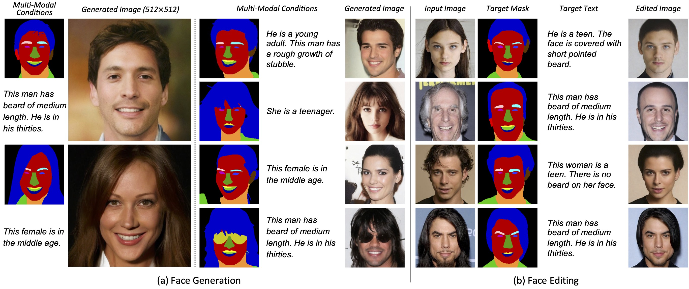
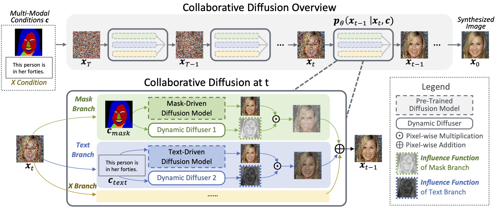

# Collaborative Diffusion (CVPR 2023)


This repository contains the implementation of the following paper:
> **Collaborative Diffusion for Multi-Modal Face Generation and Editing**<br>
> [Ziqi Huang](https://ziqihuangg.github.io/), [Kelvin C.K. Chan](https://ckkelvinchan.github.io/), [Yuming Jiang](https://yumingj.github.io/), [Ziwei Liu](https://liuziwei7.github.io/)<br>
IEEE/CVF International Conference on Computer Vision (**CVPR**), 2023

From [MMLab@NTU](https://www.mmlab-ntu.com/) affiliated with S-Lab, Nanyang Technological University

[[Paper](https://arxiv.org/abs/2304.10530)] |
[[Project Page](https://ziqihuangg.github.io/projects/collaborative-diffusion.html)] |
[[Video](https://www.youtube.com/watch?v=inLK4c8sNhc)]


## Overview
<!--  -->


We propose **Collaborative Diffusion**, where users can use multiple modalities to control face generation and editing.
    *(a) Face Generation*. Given multi-modal controls, our framework synthesizes high-quality images consistent with the input conditions.
    *(b) Face Editing*. Collaborative Diffusion also supports multi-modal editing of real images with promising identity preservation capability.

<br>


We use pre-trained uni-modal diffusion models to perform multi-modal guided face generation and editing. At each step of the reverse process (i.e., from timestep t to t − 1), the **dynamic diffuser** predicts the spatial-varying and temporal-varying **influence function** to *selectively enhance or suppress the contributions of the given modality*.

## Updates
- [10/2023] Collaborative Diffusion can support [FreeU](https://chenyangsi.top/FreeU/) now. See [here](https://github.com/ziqihuangg/Collaborative-Diffusion/tree/master/freeu) for how to run Collaborative Diffusion + FreeU.
- [09/2023] We provide inference script of face generation driven by single modality, and the scripts and checkpoints of 256x256 resolution.
- [09/2023] [Editing code](https://github.com/ziqihuangg/Collaborative-Diffusion#editing) is released.
- [06/2023] We provide the preprocessed multi-modal annotations [here](https://drive.google.com/drive/folders/1rLcdN-VctJpW4k9AfSXWk0kqxh329xc4?usp=sharing).
- [05/2023] [Training code](https://github.com/ziqihuangg/Collaborative-Diffusion#training) for Collaborative Diffusion (512x512) released.
- [04/2023] [Project page](https://ziqihuangg.github.io/projects/collaborative-diffusion.html) and [video](https://www.youtube.com/watch?v=inLK4c8sNhc) available.
- [04/2023] [Arxiv paper](https://arxiv.org/abs/2304.10530) available.
- [04/2023] Checkpoints for multi-modal face generation (512x512) released.
- [04/2023] Inference code for multi-modal face generation (512x512) released.


## Installation

1. Clone repo

   ```bash
   git clone https://github.com/ziqihuangg/Collaborative-Diffusion
   cd Collaborative-Diffusion
   ```

2. Create conda environment.<br>
If you already have an `ldm` environment installed according to [LDM](https://github.com/CompVis/latent-diffusion#requirements), you do not need to go throught this step (i.e., step 2). You can simply `conda activate ldm` and jump to step 3.

   ```bash
    conda env create -f environment.yaml
    conda activate codiff
   ```

3. Install dependencies

   ```bash
    pip install transformers==4.19.2 scann kornia==0.6.4 torchmetrics==0.6.0
    conda install -c anaconda git
    pip install git+https://github.com/arogozhnikov/einops.git
   ```

## Download

### Download Checkpoints

1. Download the pre-trained models from [Google Drive](https://drive.google.com/drive/folders/13MdDea8eI8P4ygeIyfy8krlTb8Ty0mAP?usp=sharing) or [OneDrive](https://entuedu-my.sharepoint.com/:f:/g/personal/ziqi002_e_ntu_edu_sg/ErjBxdNGbyhJtnPLFWxLJkABb1dScdz9T0kCjzYC65y17g?e=cn5F9h).

2. Put the models under `pretrained` as follows:
    ```
    Collaborative-Diffusion
    └── pretrained
        ├── 256_codiff_mask_text.ckpt
        ├── 256_mask.ckpt
        ├── 256_text.ckpt
        ├── 256_vae.ckpt
        ├── 512_codiff_mask_text.ckpt
        ├── 512_mask.ckpt
        ├── 512_text.ckpt
        └── 512_vae.ckpt
    ```
### Download Datasets
We provide preprocessed data used in this project (see Acknowledgement for data source). You need download them only if you want to reproduce the training of Collaborative Diffusion. You can skip this step if you simply want to use our pre-trained models for inference.

1. Download the preprocessed training data from [here](https://drive.google.com/drive/folders/1rLcdN-VctJpW4k9AfSXWk0kqxh329xc4?usp=sharing).

2. Put the datasets under `dataset` as follows:
    ```
    Collaborative-Diffusion
    └── dataset
        ├── image
        |   └──image_512_downsampled_from_hq_1024
        ├── text
        |   └──captions_hq_beard_and_age_2022-08-19.json
        ├── mask
        |   └──CelebAMask-HQ-mask-color-palette_32_nearest_downsampled_from_hq_512_one_hot_2d_tensor
        └── sketch
            └──sketch_1x1024_tensor
    ```

For more details about the annotations, please refer to [CelebA-Dialog](https://github.com/ziqihuangg/CelebA-Dialog).

## Generation

### Multi-Modal-Driven Generation

You can control face generation using text and segmentation mask.
1. `mask_path` is the path to the segmentation mask, and `input_text` is the text condition.

    ```bash
    python generate.py \
    --mask_path test_data/512_masks/27007.png \
    --input_text "This man has beard of medium length. He is in his thirties."
    ```
    ```bash
    python generate.py \
    --mask_path test_data/512_masks/29980.png \
    --input_text "This woman is in her forties."
    ```

2. You can view different types of intermediate outputs by setting the flags as `1`. For example,  to view the *influence functions*, you can set `return_influence_function` to `1`.

    ```bash
    python generate.py \
    --mask_path test_data/512_masks/27007.png \
    --input_text "This man has beard of medium length. He is in his thirties." \
    --ddim_steps 10 \
    --batch_size 1 \
    --save_z 1 \
    --return_influence_function 1 \
    --display_x_inter 1 \
    --save_mixed 1
    ```
    Note that producing intermediate results might consume a lot of GPU memory, so we suggest setting `batch_size` to `1`, and setting `ddim_steps` to a smaller value (e.g., `10`) to save memory and computation time.

3. Our script synthesizes 512x512 resolution by default. You can generate 256x256 images by changing the config and ckpt:
    ```bash
    python generate.py \
    --mask_path test_data/256_masks/29980.png \
    --input_text "This woman is in her forties." \
    --config_path "configs/256_codiff_mask_text.yaml" \
    --ckpt_path "pretrained/256_codiff_mask_text.ckpt" \
    --save_folder "outputs/inference_256_codiff_mask_text"
    ```


### Text-to-Face Generation
1. Give the text prompt and generate the face image:

    ```bash
    python text2image.py \
    --input_text "This man has beard of medium length. He is in his thirties."
    ```
    ```bash
    python text2image.py \
    --input_text "This woman is in her forties."
    ```

2. Our script synthesizes 512x512 resolution by default. You can generate 256x256 images by changing the config and ckpt:
    ```bash
    python text2image.py \
    --input_text "This man has beard of medium length. He is in his thirties." \
    --config_path "configs/256_text.yaml" \
    --ckpt_path "pretrained/256_text.ckpt" \
    --save_folder "outputs/256_text2image"
    ```


### Mask-to-Face Generation
1. Give the face segmentation mask and generate the face image:

    ```bash
    python mask2image.py \
    --mask_path "test_data/512_masks/29980.png"
    ```
    ```bash
    python mask2image.py \
    --mask_path "test_data/512_masks/27007.png"
    ```

2. Our script synthesizes 512x512 resolution by default. You can generate 256x256 images by changing the config and ckpt:
    ```bash
    python mask2image.py \
    --mask_path "test_data/256_masks/29980.png" \
    --config_path "configs/256_mask.yaml" \
    --ckpt_path "pretrained/256_mask.ckpt" \
    --save_folder "outputs/256_mask2image"
    ```


## Editing
You can edit a face image according to target mask and target text. We achieve this by collaborating multiple uni-modal edits. We use [Imagic](https://imagic-editing.github.io/) to perform the uni-modal edits.

1. Perform text-based editing.
    ```bash
    python editing/imagic_edit_text.py
    ```

1. Perform mask-based editing. Note that we adapted Imagic (the text-based method) to mask-based editing.
    ```bash
    python editing/imagic_edit_mask.py
    ```

3. Collaborate the text-based edit and the mask-based edit using Collaborative Diffusion.

    ```bash
    python editing/collaborative_edit.py
    ```


## Training


We provide the entire training pipeline, including training the VAE, uni-modal diffusion models, and our proposed dynamic diffusers.

If you are only interested in training dynamic diffusers, you can use our provided checkpoints for VAE and uni-modal diffusion models. Simply skip step 1 and 2 and directly look at step 3.

1. **Train VAE.**

    LDM compresses images to the VAE latents to save computational cost, and later train UNet diffusion models on the VAE latents. This step is to reproduce the `pretrained/512_vae.ckpt`.

    ```bash
    python main.py \
    --logdir 'outputs/512_vae' \
    --base 'configs/512_vae.yaml' \
    -t  --gpus 0,1,2,3,
    ```

2. **Train the uni-modal diffusion models.**

    (1) train text-to-image model. This step is to reproduce the `pretrained/512_text.ckpt`.
    ```bash
    python main.py \
    --logdir 'outputs/512_text' \
    --base 'configs/512_text.yaml' \
    -t  --gpus 0,1,2,3,
    ```
    (2) train mask-to-image model. This step is to reproduce the `pretrained/512_mask.ckpt`.
    ```bash
    python main.py \
    --logdir 'outputs/512_mask' \
    --base 'configs/512_mask.yaml' \
    -t  --gpus 0,1,2,3,
    ```


3. **Train the dynamic diffusers.**

    The dynamic diffusers are the meta-networks that determine how the uni-modal diffusion models collaborate together. This step is to reproduce the `pretrained/512_codiff_mask_text.ckpt`.
    ```bash
    python main.py \
    --logdir 'outputs/512_codiff_mask_text' \
    --base 'configs/512_codiff_mask_text.yaml' \
    -t  --gpus 0,1,2,3,
    ```


## Citation

   If you find our repo useful for your research, please consider citing our paper:

   ```bibtex
    @InProceedings{huang2023collaborative,
        author = {Huang, Ziqi and Chan, Kelvin C.K. and Jiang, Yuming and Liu, Ziwei},
        title = {Collaborative Diffusion for Multi-Modal Face Generation and Editing},
        booktitle = {Proceedings of the IEEE/CVF Conference on Computer Vision and Pattern Recognition},
        year = {2023},
    }
   ```


## Acknowledgement

The codebase is maintained by [Ziqi Huang](https://ziqihuangg.github.io/).

This project is built on top of [LDM](https://github.com/CompVis/latent-diffusion). We trained on data provided by [CelebA-HQ](https://github.com/tkarras/progressive_growing_of_gans), [CelebA-Dialog](https://github.com/ziqihuangg/CelebA-Dialog), [CelebAMask-HQ](https://mmlab.ie.cuhk.edu.hk/projects/CelebA/CelebAMask_HQ.html), and [MM-CelebA-HQ-Dataset](https://github.com/IIGROUP/MM-CelebA-HQ-Dataset). We also make use of the [Imagic implementation](https://github.com/justinpinkney/stable-diffusion/blob/main/notebooks/imagic.ipynb).
