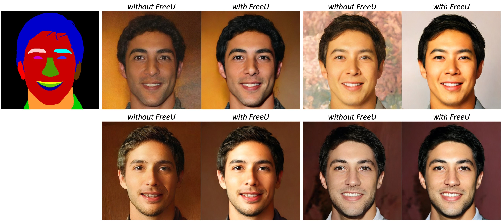
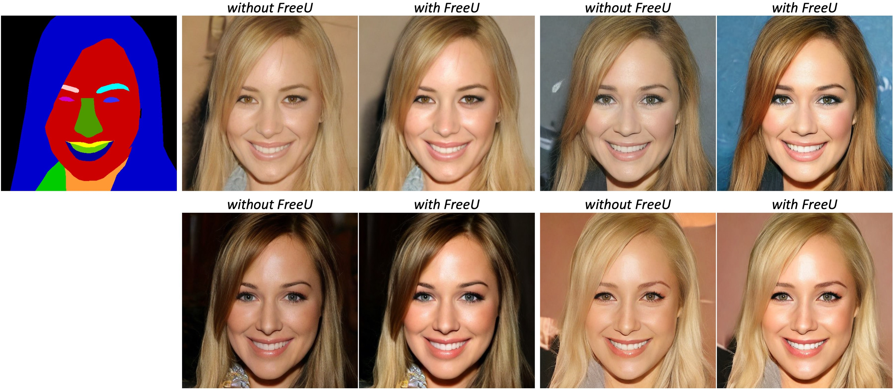
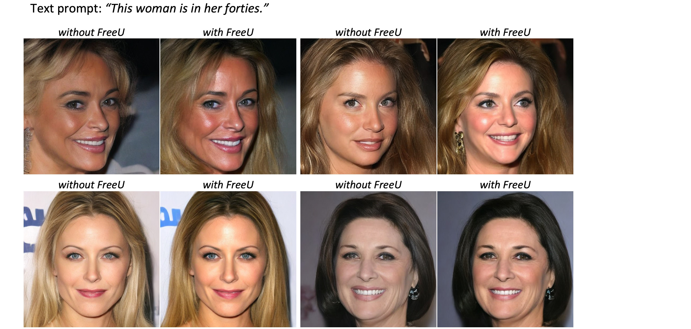
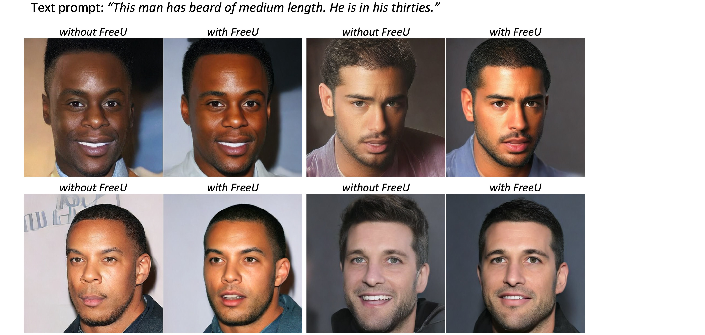

# Face Generation + FreeU
We now integrated [FreeU](https://chenyangsi.top/FreeU/) [](https://huggingface.co/spaces/ChenyangSi/FreeU) into the LDMs to further boost synthesis quality.
We adapted FreeU's [code](https://github.com/ChenyangSi/FreeU) for our face generation diffusion models.
For more details about FreeU, please refer to the [paper](https://arxiv.org/abs/2309.11497).

## Mask-to-Face Generation:



1. without FreeU
    ```bash
    python freeu/mask2image_freeu.py \
    --mask_path "test_data/512_masks/27007.png"
    ```
2. with FreeU
    ```bash
    python freeu/mask2image_freeu.py \
    --mask_path "test_data/512_masks/27007.png" \
    --enable_freeu \
    --b1 1.1 \
    --b2 1.2 \
    --s1 1 \
    --s2 1
    ```
## Text-to-Face Generation:




1. without FreeU
    ```bash
    python freeu/text2image_freeu.py \
    --input_text "This man has beard of medium length. He is in his thirties."
    ```
2. with FreeU
    ```bash
    python freeu/text2image_freeu.py \
    --input_text "This man has beard of medium length. He is in his thirties." \
    --enable_freeu \
    --b1 1.1 \
    --b2 1.2 \
    --s1 1 \
    --s2 1
    ```
another example:
1. without FreeU
    ```bash
    python freeu/text2image_freeu.py \
    --input_text "This woman is in her forties."
    ```
2. with FreeU
    ```bash
    python freeu/text2image_freeu.py \
    --input_text "This woman is in her forties." \
    --enable_freeu \
    --b1 1.1 \
    --b2 1.2 \
    --s1 1 \
    --s2 1
    ```
